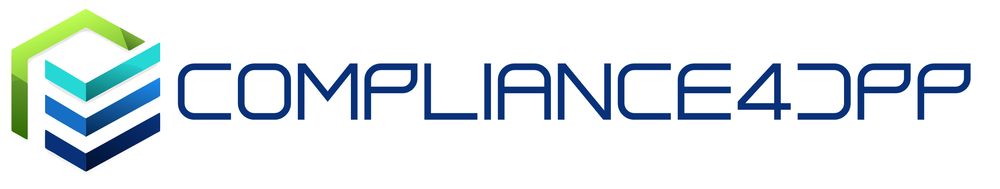

# Compliance4DPP Project
Fostering Resilient and Auto-Compliant Manufacturing Value Chains through Advanced Digital Product Passports and Interoperable Data Ecosystems for a Circular Economy

## Website

Website: [https://compliance4dpp.eu/](https://compliance4dpp.eu/)

## Logo

## About

COMPLIANCE4DPP will leverage Gaia-X architectural frameworks and proven practices to ensure transparency, openness, reliability, security, and interoperability in data exchange with auto-compliance tools along the value chain with digital product passport (DPP). Thereby, it addresses destination Area 3 "Actions to generate, manage and leverage synthetic data in order to improve data quality, availability, representativity, fitness for purpose and compliance". As several consortium members are involved in developing and operating manufacturing data ecosystems, a rich set of shared capabilities and value-adding services are being established. The developments from those projects have shown that one of the problems is the validation of compliance of actors and transactions, in order to establish trust as a key foundation for collaborative data usage. The understanding of the benefits of Gaia-X as de-facto standard for trust provisioning in distributed data ecosystems. Furthermore, the Digital Product Passport (DPP) is perceived in the industry as more of an imposed regulatory constraint than as an opportunity for new business models. However, Digital Product Passports shall in the future create several benefits for its stakeholders in manufacturing ecosystems, where data is granularly and selectively accessible in line with Europe’s privacy and security provisions and other applicable laws and regulations. Consequently, the overall objective of COMPLIANCE4DPP is to support the green and digital transition. It enhances existing sovereign and interoperable data service ecosystem architecture with automated compliance demonstrated on the challenging DPP regulation. Two concrete use cases showcase the readiness for deployment across multiple domains/value chains.

## Goals

COMPLIANCE4DPP will leverage Gaia-X architectural frameworks and proven practices to ensure transparency, openness, reliability, security, and interoperability in data exchange with auto-compliance tools along the value chain with digital product passport (DPP).

The overall objective of COMPLIANCE4DPP is to support the green and digital transition. It enhances existing sovereign and interoperable data service ecosystem architecture with automated compliance demonstrated on the challenging DPP regulation.

## Coordinator
EIT Manufacturing East GmbH, [https://eitmanufacturing-east.eu/](https://eitmanufacturing-east.eu/)

## Timing
- Start: June 1, 2026
- End: May 31, 2029

## Funding

Funded by the European Union under Horizon Europe Grant Agreement No. 101298718 — COMPLIANCE4DPP. Views and opinions expressed are however those of the author(s) only and do not necessarily reflect those of the European Union or the granting authority. Neither the European Union nor the granting authority can be held responsible for them.
